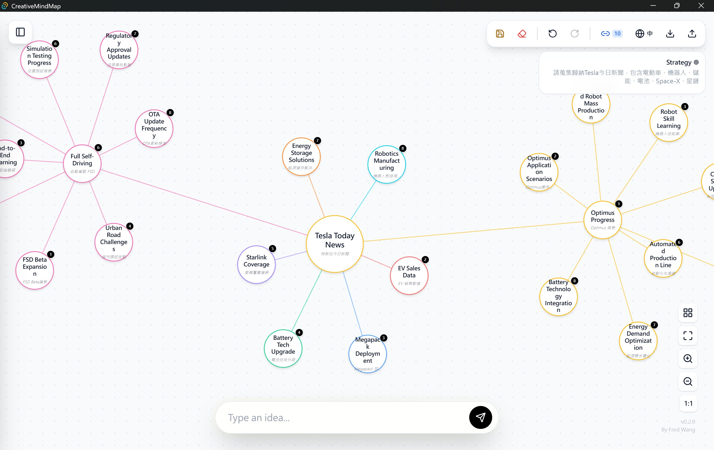
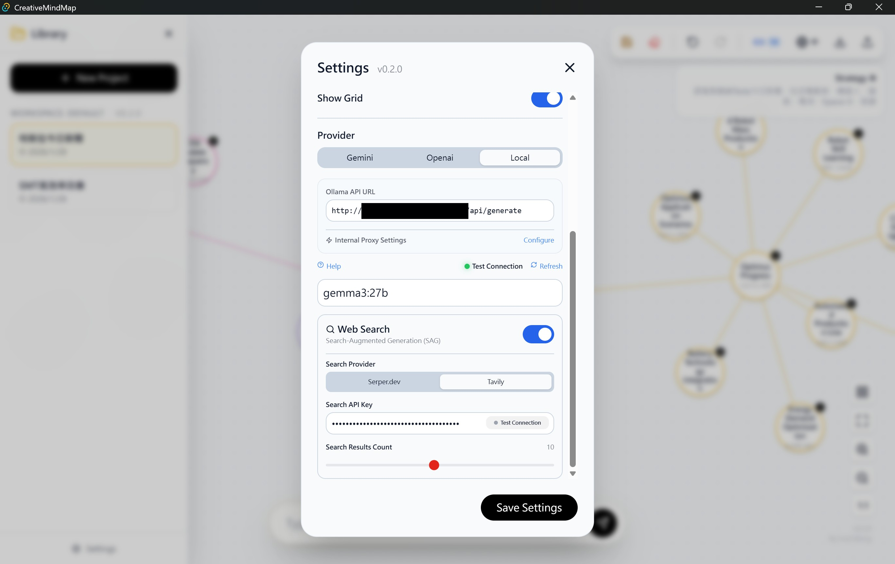
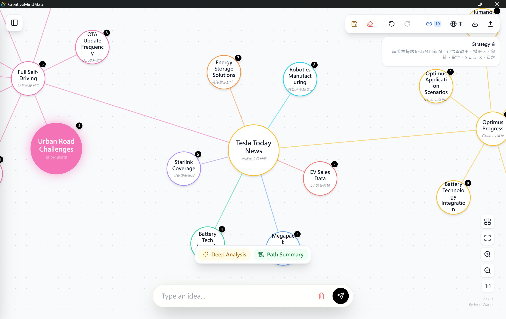
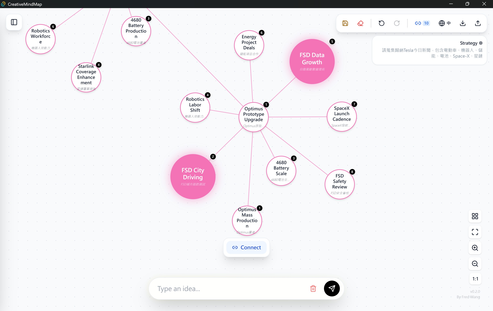

# Creative MindMap by Brainstorm AI (創意發散) v0.2.0

> **設定目標，讓 AI 成為您的策略顧問。**  
> Set a goal, let AI guide you.

[🇹🇼 繁體中文 (Traditional Chinese)](./README.md) | [🇺🇸 English (英文)](./README_EN.md)

Creative MindMap by Brainstorm AI 是一個互動式的 AI 心智圖工具，旨在幫助您發想創意、分析策略並視覺化各種關聯。無論您是在規劃行銷活動、撰寫故事，還是整理思緒，Creative MindMap by Brainstorm AI 都能利用先進的大型語言模型 (LLMs) 來擴展您的思考邊界。

<p align="center">
  <b>CreativeMindMap UI Preview</b>
</p>

<table align="center">
  <tr>
    <td align="center">
      <br>
      <sub>Main UI</sub>
    </td>
    <td align="center">
      <br>
      <sub>Settings</sub>
    </td>
  </tr>
  <tr>
    <td align="center">
      <br>
      <sub>AI Deep Analysis & Path Summary</sub>
    </td>
    <td align="center">
      <br>
      <sub>Connect</sub>
    </td>
  </tr>
</table>

## ✨ 核心功能 (Key Features)

-   **🤖 AI 驅動腦力激盪**: 輸入核心主題，讓 AI 自動生成策略性的子概念與可執行的想法。
-   **🧠 深度分析 & 路徑總結**:
    -   點選任意節點獲取結構化報告。
    -   自動總結邏輯路徑。
    -   **[NEW]** 支援 **Markdown 格式化** 與 **可點擊網頁連結**，直接從分析視窗跳轉至參考來源。
-   **🔗 探索關聯**: 選取兩個節點，讓 AI 發掘並解釋它們之間隱藏的關聯。
-   **🔐 隱私與安全**: 所有的 API Key 與專案資料皆儲存於本地 `localStorage`，不經過第三方伺服器。
-   **🌍 雙語支援**: 無縫在 **繁體中文** 與 **英文** 之間切換。
-   **🎨 高度客製化介面**: 支持多種主題 (Cyberpunk, Retro) 與節點形狀。

## 🚀 支援的 AI 供應商

1.  **Google Gemini**
    -   模型：`models/gemini-2.0-flash`, `models/gemini-1.5-pro` 等。
    -   特色：極速回應，整合 **Google Search Grounding** 獲取即時資訊。
2.  **OpenAI**
    -   模型：`gpt-4o`, `gpt-4o-mini-search-preview` 等。
    -   **[NEW]** 支援 **Responses API**: 可配置 **搜尋深度 (Search Depth)**，利用 OpenAI 的網路搜尋功能獲取深度洞察。
3.  **Local LLM (Ollama)**
    -   **[NEW] 搜尋增強生成 (SAG)**: 即使是本機模型，也能整合 `Serper.dev` 或 `Tavily` API 進行即時網路搜尋。
    -   支援模型：`llama3.1`, `mistral`, `gemma2` 等。

## 🛠️ 安裝與啟動 (v0.2.0 Electron 版)

### 先決條件
-   Node.js (v18 或更高版本)
-   npm 或 yarn

### 步驟
1.  **Clone 儲存庫**
    ```bash
    git clone https://github.com/fred-lede/CreativeMindMap.git
    cd CreativeMindMap
    ```

2.  **安裝依賴套件**
    ```bash
    npm install
    ```

3.  **開發模式啟動**
    ```bash
    npm run electron:dev
    ```

4.  **打包應用程式 (Build)**
    ```bash
    npm run electron:build
    ```

## ⚙️ 設定說明

### API 連線測試
在設定面板中，每個供應商現在都配備了 **[連線測試]** 按鈕。輸入 Key 後可立即驗證連線是否成功。

### 網路搜尋設定
-   **Gemini**: 直接開啟 "Web Search"。
-   **OpenAI**: 開啟後可選擇 Low/Medium/High 搜尋深度。
-   **Local**: 可選擇 Serper 或 Tavily 作為搜尋提供商（需填寫對應 API Key）。

### 使用本機 LLM (Ollama)
若要透過 Ollama 使用本機模型，您必須設定 CORS 以允許連線。

1.  **設定 `OLLAMA_ORIGINS` 環境變數**:
    -   **Windows (PowerShell)**: `$env:OLLAMA_ORIGINS="*"; ollama serve`
    -   **macOS / Linux**: `OLLAMA_ORIGINS="*" ollama serve`

2.  **內網/遠端 Ollama**: 
    如果您連線至遠端 Ollama 伺服器，建議在設定中配置正確的 **Endpoint URL**。版本 0.2.0 已優化跨網域連線處理。

## 📄 授權 (License)

MIT License
